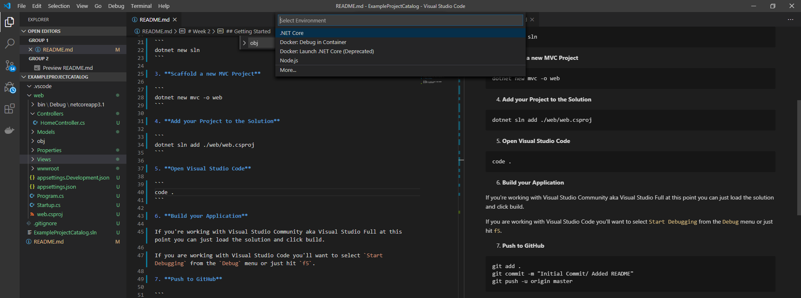

# Week 2

## Requirements:

Commit a new Solution and MVC Project to GitHub.

## Expectation:

At the end of this instructional you will have a templated MVC Application that you can build.

## Getting Started

1. **Create a new branch**

The <code>-b</code> parameter passed into the <code>git checkout</code> method will create a new branch with the name specified.

```
git checkout -b Week2
```

2. **Scaffold a new Solution**

Using the dotnet cli the <code>sln</code> parameter will create a new solution in the current directory named after the folder in which it's contained.

```
dotnet new sln
```

3. **Scaffold a new MVC Project**

Using the dotnet cli <code>mvc</code> is one of the template types preinstalled with dotnet core. The <code>-o</code> parameter will create the project template in the specified output directory (o stands for output). Optionally, you can also include the '-n' parameter to name the project, or by default it will be named the same as the output directory.

```
dotnet new mvc -o web
```

**For example:** This command creates a folder called web containing the MVC template generated files and web.csproj.

4. **Add your Project to the Solution**

In dotnet a solution is a grouping of one or more projects that work together to create an application. You can read more abou these [here](https://docs.microsoft.com/en-us/visualstudio/extensibility/internals/solutions-overview?view=vs-2019). The following command will add our 'web' project to our generated solution.

```
dotnet sln add ./web/web.csproj
```

5. **Add a .ignore file**

The '.ignore' file is responsible for telling git which files don't need to be checked into source control. By default it's going to omit a lot, but the ones you'll recognize are the compilable bin and obj folders. 

```
dotnet new ignore
```

6. **Open Visual Studio Code**

I've chosen to teach this tutorial in visual studio code because it's a light weight IDE that runs on Mac, Linux, and Windows. I am only including the commands as I understand them for Windows, but there is very little variation. Just stay cognizant that if one of the commands you're instructed to use doesn't work, and you're not on Windows, that might be why. 

```
code .
```

7. **Build your Application**

If you're working with Visual Studio Community aka Visual Studio Full at this point you can just load the solution and click build.

If you are working with Visual Studio Code you have to tell your IDE how to build your application, so you'll want to select `Start Debugging` from the `Debug` menu or just hit `f5`.



Replace the generated launch.json settings with the following settings

```json
{
    "version": "0.2.0",
    "configurations": [
        {
            "name": ".NET Core Launch (web)",
            "type": "coreclr",
            "request": "launch",
            "preLaunchTask": "build",
            "program": "${workspaceFolder}/web/bin/Debug/netcoreapp3.1/web.dll",
            "args": [],
            "cwd": "${workspaceFolder}/web",
            "stopAtEntry": false,
            "launchBrowser": {
                "enabled": true
            },
            "env": {
                "ASPNETCORE_ENVIRONMENT": "Development"
            },
            "sourceFileMap": {
                "/Views": "${workspaceFolder}/web/Views"
            }
        },
        {
            "name": ".NET Core Attach",
            "type": "coreclr",
            "request": "attach",
            "processId":"${command:pickProcess}"
        }
    ]
}
```
The above settings are a slight modification of the generated settings targeting the folder `web`. 

Save your launch.json settings, navigate to the debug menu and click play.


8. **Push to GitHub**

```
git add .
git commit -m "Initial Commit/ Added README"
git push -u origin Week2
```

---

You just created your first MVC application and pushed it to GitHub. A lot of these commands are boilerplate and that's how I start most of my professional solutions. For a full list of the commands you used and their definitions- refer to my [CLI Cheat Sheet](https://davewritescode.com/blog/cli-cheat-sheet/)