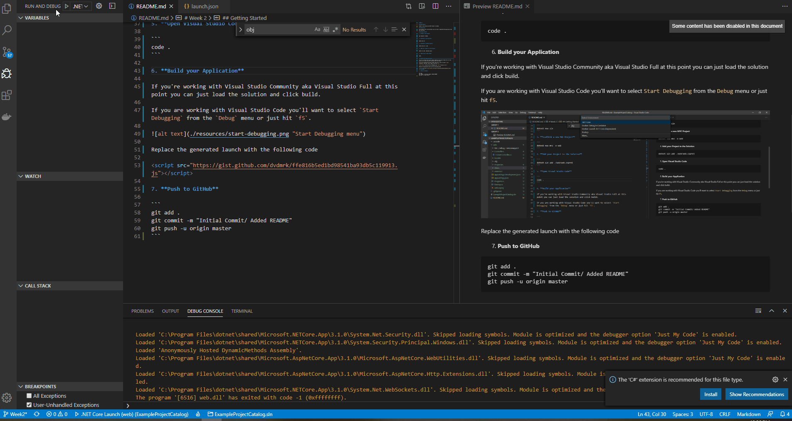

# Week 2

## Requirements:

Commit a new Solution and MVC Project to GitHub.

## Expectation:

At the end of this instructional you will have a templated MVC Application that you can build.

## Getting Started

1. **Create a new branch**

```
git checkout -b Week2
```

2. **Scaffold a new Solution**

```
dotnet new sln
```

3. **Scaffold a new MVC Project**

```
dotnet new mvc -o web
```

4. **Add your Project to the Solution**

```
dotnet sln add ./web/web.csproj
```

5. **Add a .ignore file**

```
dotnet new ignore
```

6. **Open Visual Studio Code**

```
code .
```

7. **Build your Application**

If you're working with Visual Studio Community aka Visual Studio Full at this point you can just load the solution and click build.

If you are working with Visual Studio Code you have to tell your IDE how to build your application, so you'll want to select `Start Debugging` from the `Debug` menu or just hit `f5`.


Replace the generated launch.json settings with the following settings

```json
{
    "version": "0.2.0",
    "configurations": [
        {
            "name": ".NET Core Launch (web)",
            "type": "coreclr",
            "request": "launch",
            "preLaunchTask": "build",
            "program": "${workspaceFolder}/web/bin/Debug/netcoreapp3.1/web.dll",
            "args": [],
            "cwd": "${workspaceFolder}/web",
            "stopAtEntry": false,
            "launchBrowser": {
                "enabled": true
            },
            "env": {
                "ASPNETCORE_ENVIRONMENT": "Development"
            },
            "sourceFileMap": {
                "/Views": "${workspaceFolder}/web/Views"
            }
        },
        {
            "name": ".NET Core Attach",
            "type": "coreclr",
            "request": "attach",
            "processId":"${command:pickProcess}"
        }
    ]
}
```
The above settings are a slight modification of the generated settings targeting the folder `web`. 

Save your launch.json settings, navigate to the debug menu and click play.



8. **Push to GitHub**

```
git add .
git commit -m "Initial Commit/ Added README"
git push -u origin Week2
```

---

You just created your first MVC application and pushed it to GitHub. A lot of these commands are boilerplate and that's how I start most of my professional solutions. For a full list of the commands you used and their definitions- refer to my [CLI Cheat Sheet](https://davewritescode.com/blog/cli-cheat-sheet/)