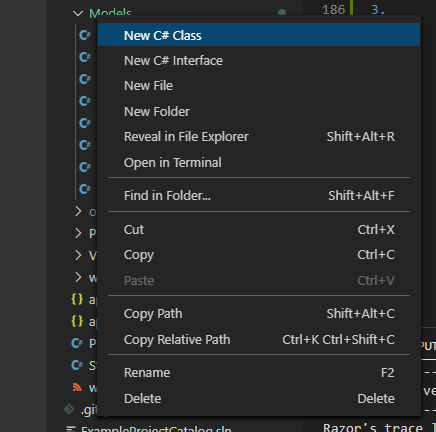

# Week 3

## Requirements:

By the end of this tutorial you will have at least 1 class representing all or some of that data you will be performing CRUD operations on (you can add to these later).

## Expectation:

Populate the models folder of your MVC application with any classes required to generate your database and any required relationships (you should work with your mentor/ mentors to determine the data you will be modeling).

---

## Exercise - Modeling Data

We will be using the classes created in this tutorial to scaffold our database from a code first approach. That means we're going to write code that defines our database schema. To put it simply:

- Each class will be table.
- Each field on a class will be a column in that table.
- Each new entry in the database will be a row in that table.

Thinking about your idea, what objects does it rely on? For the next few exercises we are going to model Car data. This might be useful if we run a website that lists cars and car information. For this example, 'Car' would be our class and fields like Make, Model and Year would be our fields. Our Car class with the Make property would look like the following:

```csharp
namespace web.Models
{
    public class Car
    {
        public string Make { get; set; }
    }
}
```

In this example we are defining Make as a string. However, Make could also be its own class defined like this:

```csharp
public Make Make { get; set; }
```

We can also define fields of other simple and complex propery types. A simple type would be: int, bool, double, etc- and a complex type would be another class or Collection of a Class.

### Modeling Fields

Challenge

<code>Model the data for a Car class with the fields: Make, Model, Year, and MPH (Miles per Hour).</code>

<details>
<summary>Answer</summary>

```csharp
namespace web.Models
{
    public class Car
    {
        public string Make { get; set; }
        public string Model { get; set; }   
        public int Year { get; set; }
        public double MPG { get; set; }
    }
}
```

</details>

### Modeling Complex Fields

Challenge

<code>Create another class for an Engine, and add it as a field on the Car class.</code>

<details>
<summary>Answer</summary>

```csharp
namespace web.Models
{
    public class Car
    {
        public string Make { get; set; }
        public string Model { get; set; }   
        public int Year { get; set; }
        public double MPG { get; set; }
        public Engine Engine { get; set; }
    }

    public class Engine
    {
    }
}
```

</details>

> #### When modeling relationships to generate a database with Entity Framework Core, you have to be more specific about the relationship and how the database should be created. [Entity Framework Relationships Documentation](https://docs.microsoft.com/en-us/ef/core/modeling/relationships?tabs=fluent-api%2Cfluent-api-simple-key%2Csimple-key)

<a name="examples"></a>

## Example - Modeling Relationships

After reviewing the above documentation, there are a few additional rules to follow for modeling our Classes to scaffold our database.

- One-to-One
  - We need to add an index for the related object.

```csharp
public Guid MakeId { get; set; }
public Make Make { get; set; }
```

- One-to-Many
   - We need to define the relationship as a collection on one side, and a complex object with an index on the other side.
   - Imagine if an ower had a collection of cars:

```csharp
using System;
using System.Collections.Generic;
using System.ComponentModel.DataAnnotations;

namespace web.Models
{
    public class Base
    {
        public Guid Id { get; set; }
    }
    public class Owner : Base
    {
        public ICollection<Car> Cars { get; set; }
    }
    public class Car : Base
    {
        public Guid OwnerId { get; set; }
        public Owner Owner { get; set; }
        public string Make { get; set; }
        public string Model { get; set; }   
        public int Year { get; set; }
        public double MPG { get; set; }
    }
}
```

- Many-to-Many
   - We need to define a bridge table that explicitly references both objects and their index properties, and the relating classes need to have a collection of their related objects.

```csharp
using System;
using System.Collections.Generic;
using System.ComponentModel.DataAnnotations;

namespace web.Models
{
    public class Base
    {
        public Guid Id { get; set; }
    }
    public class Car : Base
    {
        public string Make { get; set; }
        public string Model { get; set; }   
        public int Year { get; set; }
        public double MPG { get; set; }
        public ICollection<Engine> Engine { get; set;}
    }
    public class Engine : Base 
    {
        public ICollection<Car> Cars { get; set; }
    }
    public class CareEngines 
    {
        public Guid CarId { get; set; }
        public Car Car { get; set; }
        public Guid EngineId { get; set; }
        public Engine Engine { get; set; }
    }
}
```

---

## Getting Started

1. Create a new branch for your current repository:

<code>git checkout -b Week3</code>

2. Create at least 1 new class in the models folder of your MVC Project to represent a table/ tables in your database.



I've created the following new classes to represt Exapmle Project Data:

- ExampleProject.cs
- ExampleProjectTechnology.cs
- Milestone.cs
- Outcome.cs
- Student.cs
- Technology.cs

**What are the objects your application will create, read, update, and delete?**

> If you start with 1 well defined class, you can always go back and add more.

3. Create the fields on this new class/ classes which will represent the columns in the table/ tables.

<code>ExampleProject.cs</code>

This will be my ExampleProjects table, it will store an example project for each student. For this class I know that I'll need the RepositoryName if I want to be able to grade it.

```csharp
using System;
using System.Collections.Generic;
namespace web.Models
{
    public class ExampleProject : BaseEntity
    {
        public string RepositoryName { get; set; }
    }
}
```

As you can see I'm using inheritance with <code>BaseEntity</code>. I'm using this because I realized that all of my entities would have an identifier and a name. The inheritance allows any derrived objects to maintain those properties.

<code>BaseEntity.cs</code>

```csharp
using System;
namespace web.Models
{
    /// <summary>
    /// All named database entities will inherit from this class.
    /// </summary>
    public class BaseEntity
    {
        public Guid Id { get; set; }
        public string Name { get; set; }
    }
}
```

> Above I am using the summary xml tag so that when someone hovers over the class name, they'll get a summary of it's purpose.

<code>ExampleProjectTechnology.cs</code>

This will serve as a bridge table for the Many-to-Many relationship between ExampleProjects and Technologies. We will return to this in the next step.

<code>MileStone.cs</code>

For this class I want to know what the goal was, and the name of the result branch. As a developer, I can calculate your github url + your repository name + your branch name to generate a link to your latest commits on that branch. As a mentor, that link will help me see if you are achieving your goals. There will be a One-to-Many relationhship we'll configure in step 4.

```csharp
using System;
namespace web.Models
{
    public class Milestone : BaseEntity
    {
        public string Goal {get;set;}
        public string BranchName {get;set;}
    }
}
```

<code>Outcome.cs</code>

This class will be a table in the database that stores the grade of your example project. In step 4 we will establish a One-to-One relationship with ExampleProject.

```csharp
using System;
namespace web.Models
{
    public class Outcome : BaseEntity
    {
        public int Grade { get; set; }
    }
}
```

<code>Student.cs</code>

As I mentioned earlier, a link to your github can be useful for me as a mentor. Students will also have a One-to-Many relationship with ExampleProjects configured in step 4.

```csharp
using System.Collections.Generic;
namespace web.Models
{
    public class Student : BaseEntity
    {
        public string GitHubUrl { get; set; }
    }
}
```

<code>Technology.cs</code>

On the technology class I want a description of what it will be. For example: C#, React, Vue, Swift, Python, etc... This will be valuable for displaying as a list to other students looking for example projects.

```csharp
using System.Collections.Generic;
namespace web.Models
{
    public class Technology : BaseEntity
    {
        public string Description {get;set;}
        public TechnologyType TechnologyType {get;set;}
    }
}
```

<code>TechnologyType.cs</code>

This is an enum which allows us to represent numeric data with string values. An enum is defined in a comma separated list, where the first value is 0 unless specified otherwise, and increases by 1 with all additional values. This will create an integer column in our database.

```csharp
namespace web.Models
{
    public enum TechnologyType
    {
        Frontend,
        Backend,
        Database
    }
}
```

4. Configure any required relationships.


**ExampleProject**

Example project has One-to-One relationship with Outcome. To establish this we need the following code on the ExampleProject and the Outcome class.

## One-to-One

<code>ExampleProject.cs</code>

```csharp
using System;
using System.Collections.Generic;
namespace web.Models
{
    public class ExampleProject : BaseEntity
    {
        public Guid OutcomeId { get; set; }
        /// <summary>
        /// This is a one-to-one relationship with Outcome
        /// <summary>
        public Outcome Outcome { get; set; }
    }
}
```

<code>Outcome.cs</code>

```csharp
using System;
namespace web.Models
{
    public class Outcome : BaseEntity
    {
        public Guid ExampleProjectId { get; set; }
        /// <summary>
        /// This is a one-to-one relationship with ExampleProject
        /// <summary>
        public ExampleProject ExampleProject { get; set; }
    }
}
```

Example project also has a One-to-Many relationship with Students, where 1 student can have many example projects. To establish this relationship we need the following code in ExampleProject and Student classes.

## One-to-Many

<code>ExampleProject.cs</code>

```csharp
using System;
using System.Collections.Generic;
namespace web.Models
{
    public class ExampleProject : BaseEntity
    {
        public Guid StudentId { get; set; }
        /// <summary>
        /// This is a one-to-many relationship with Student
        /// <summary>
        public Student Student { get; set; }
    }
}
```

<code>Student.cs</code>

```csharp
using System.Collections.Generic;
namespace web.Models
{
    public class Student : BaseEntity
    {
        /// <summary>
        /// This is a one-to-many relationship with ExampleProjects
        /// <summary>
        public ICollection<ExampleProject> ExampleProject { get; set; }
    }
}
```

ExampleProject also has a Many-to-Many relationship with Technology, this is expressed through the class ExampleProjectTechnology. To represent this relationship we also need to add fields to the Technology class and the ExampleProject.

## Many-to-Many

<code>ExampleProject.cs</code>

```csharp
using System;
using System.Collections.Generic;
namespace web.Models
{
    public class ExampleProject : BaseEntity
    {
        /// <summary>
        /// This is a many-to-many relationship between Example Projects and Technologies        
        /// <summary>
        public ICollection<ExampleProjectTechnology> ExampleProjectTechnologies { get; set; }
    }
}
```

<code>Technology.cs</code>

```csharp
using System.Collections.Generic;
namespace web.Models
{
    public class Technology : BaseEntity
    {
        /// <summary>
        /// This is a many-to-many relationship between ExampleProjects and Technologies
        /// <summary>
        public ICollection<ExampleProjectTechnology> ExampleProjectTechnologies {get;set;}
    }
}
```

<code>ExampleProjectTechnology.cs</code>

```csharp
using System;

namespace web.Models
{
    /// <summary>
    /// This is a many-to-many relationship between Example Projects and Technologies
    /// <summary>
    public class ExampleProjectTechnology
    {
        public Guid ExampleProjectId { get; set; }
        public Guid TechnologyId { get; set; }
        public ExampleProject ExampleProject { get; set; }
        public Technology Technology { get; set; }
    }
}
```

> Your classes may look different, but the way you define relationships should look simillar. 

5. Push your project to GitHub:

```
git add .
git commit -m "Added models"
git push -u origin Week3
```

---

## Example Project Reference

In the [Example Project Models Folder](../../tree/Week3/web/Models):

- a One-to-One relationship is implemented between: [Example Project](../../tree/Week3/web/Models/ExampleProject.cs#L23) and [Outcome](../../tree/Week3/web/Models/Outcome.cs#L11)
- a One-to-Many relationship is implemented between: [Student](../../tree/Week3/web/Models/Student.cs#L11) and [Example Projects](../../tree/Week3/web/Models/ExampleProject.cs#L14)
- a Many-to-Many relationship is implemented between: [Example Projects](../../tree/Week3/web/Models/ExampleProject.cs#L18) and [Technologies](../../tree/Week3/web/Models/Technology.cs#L15) using the [ExampleProjectTechnology](../../tree/Week3/web/Models/ExampleProjectTechnology.cs) Class.

